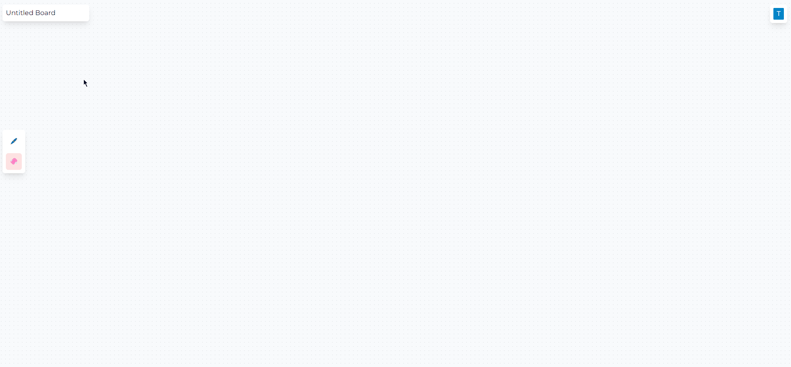
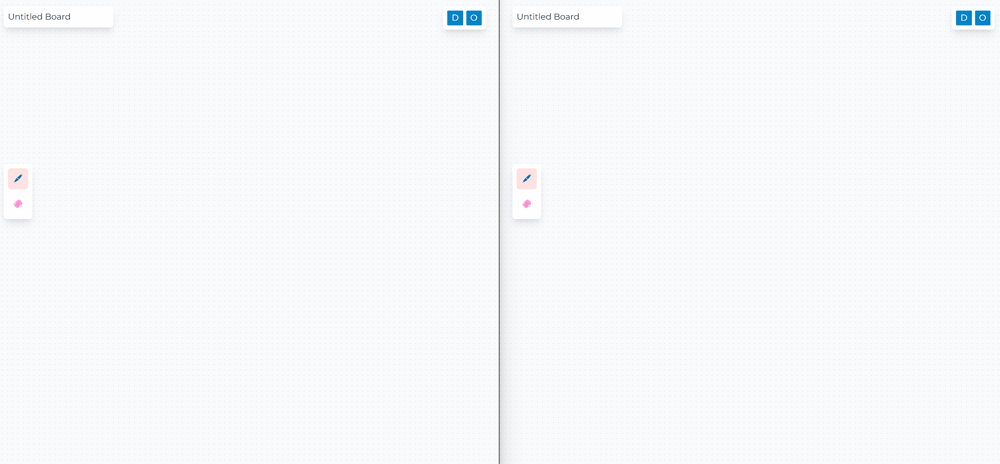

# Whibo

---

## What is this?

Collaborative whiteboard built with the HTML canvas. Get started by creating an account and sharing a link to your whiteboard.

## What was this built with?

**Frontend**

- Next.JS

**Backend**

- Node.JS [backend framework]
- Socket.io [UDP communication]
- PostgreSQL [Database]
- Passport [User authentication]

**Examples**
*Drawing*

*Collaborate*
